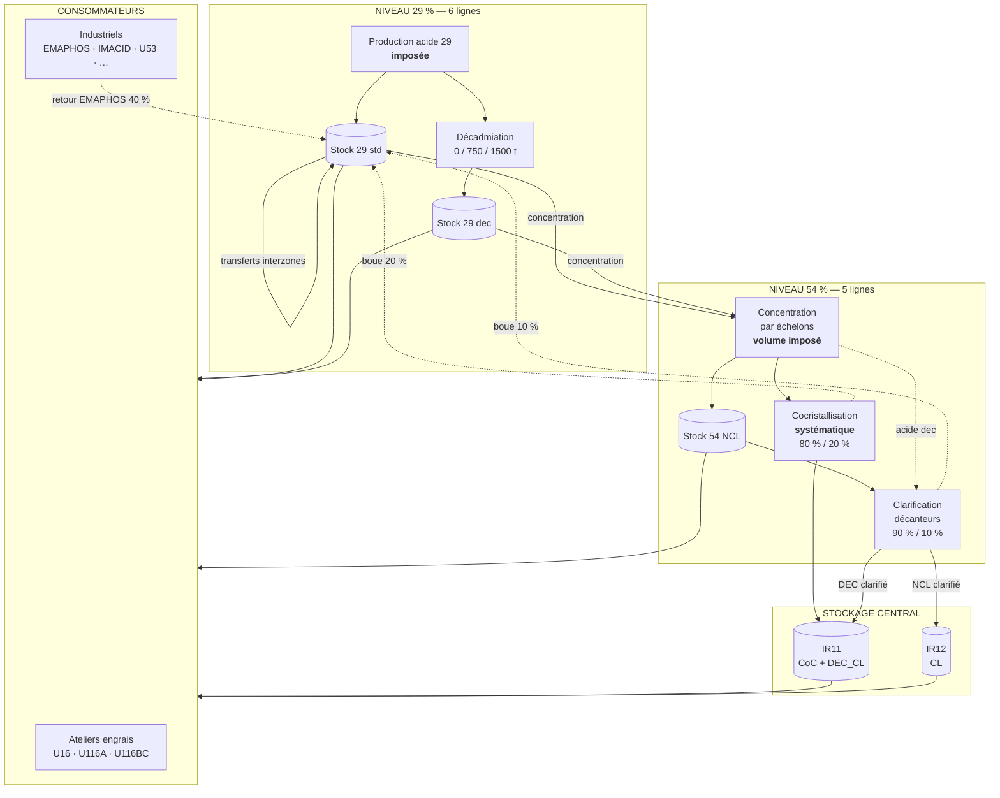

# 03 — LE PROCÉDÉ INDUSTRIEL EN DÉTAIL

> **Le document le plus important du dossier.** Il décrit le système physique, organe par
> organe, dans l'ordre où la matière le traverse.
> Chaque section se termine par un encadré **« Ce qu'il faut retenir pour le modèle »** qui
> annonce la contrainte mathématique correspondante.
>
> Rappel permanent : **toutes les quantités sont en tonnes de P₂O₅ par jour.**

---

## 1. Vue d'ensemble



**Lecture du schéma.** La matière descend du niveau 29 vers le niveau 54, puis vers les
clients. Trois flux la font **remonter** : les deux boues de traitement et le retour
d'EMAPHOS. Ce sont ces boucles qui rendent les bilans matière non triviaux.

---

## 2. Étage 1 — Production d'acide 29

### 2.1 Ce qui se passe physiquement
Le minerai de phosphate est attaqué par l'acide sulfurique. La réaction produit de l'acide
phosphorique dilué et du gypse (sulfate de calcium), séparés par filtration. On obtient un
acide titrant environ 26 % de P₂O₅.

### 2.2 Les six lignes et leur production

| Ligne | Production (scénario réel) | Ligne P54 alimentée |
|---|---|---|
| 13AB | 1 500 | 14AB |
| 13CD | 1 500 | 14CD |
| 13XY | 1 500 | 14XY |
| 13ZU | **800** | 14ZU |
| 13E | 1 500 | 14EXT |
| 13F | 1 500 | **aucune** |
| **Total** | **8 300 t P₂O₅/j** | |

`13ZU` produit nettement moins : ligne partiellement à l'arrêt ou en maintenance.
`13F` n'a **pas** de ligne de concentration associée : tout son acide part directement aux
clients ou en transfert interzone. C'est de fait le **réservoir souple du système**.

> ### Ce qu'il faut retenir pour le modèle
> La production est un **paramètre**, noté $P_\ell$. On ne la décide pas.
> C'est la première chose qui surprend : dans beaucoup de problèmes d'école, la production
> est la variable principale. Ici, elle est **subie**.

### 2.3 La décadmiation

**But.** Retirer le cadmium, métal lourd toxique, pour respecter les seuils réglementaires
européens sur les engrais.

**Où.** Au niveau 29, juste après la production.

**Comment.** Par filtres. **Un filtre traite 750 t/jour.** Une ligne dispose d'au plus
2 filtres.

**Conséquence décisive :**
$$d_\ell \in \{0,\; 750,\; 1500\}$$

Ce n'est **pas** une variable continue. On ne peut pas décadmier 312 t : on allume 0, 1 ou
2 filtres, un point c'est tout.

**Effet sur la production.** La décadmiation ne crée pas de matière, elle **répartit** la
production existante :
$$P_\ell = \underbrace{P_\ell - d_\ell}_{\text{reste standard}} + \underbrace{d_\ell}_{\text{devient décadmié}}$$

*Exemple.* 13CD produit 1 500 t et décadmie 750 t → 750 t d'acide standard + 750 t d'acide
décadmié.

**Contrainte de faisabilité évidente :** $d_\ell \le P_\ell$.
Pour 13ZU qui produit 800 t, le niveau 1 500 est donc **impossible**.

**Qui peut décadmier ?** Seules les lignes équipées de filtres. Dans le scénario réel :
`13AB`, `13CD`, `13XY`, `13ZU`, `13F` — mais pas `13E`.

> ### Ce qu'il faut retenir pour le modèle
> Trois faits, trois conséquences :
> 1. Niveaux discrets → **variables binaires** → le problème est un **MILP**, pas un PL.
> 2. Partage de la production → contrainte $P^{std}_\ell = P_\ell - d_\ell$.
> 3. Capacité limitée → $d_\ell \le P_\ell$ et $d_\ell = 0$ si la ligne n'est pas équipée.

### 2.4 Le stockage de l'acide 29

Chaque ligne possède **2 cuves**, partagées entre acide standard et acide décadmié.
Les deux qualités sont **suivies séparément** (on ne les mélange pas), mais elles se
**partagent le volume total**.

$$S^{std}_\ell + S^{dec}_\ell \;\le\; Z^{\max}_{29}$$

> ### Ce qu'il faut retenir pour le modèle
> Deux stocks distincts, **une seule** contrainte de capacité portant sur leur somme.
> Erreur classique à éviter : imposer $Z^{\max}$ à chacun séparément — cela autoriserait
> le double du volume physique réel.

### 2.5 Les transferts interzones

**But.** Rééquilibrer les stocks entre lignes. Trois motifs :
1. une cuve va **déborder** → évacuer ;
2. une cuve va **se vider** → alimenter ;
3. une ligne de concentration a besoin de **plus d'acide 29 que sa ligne amont n'en produit**.

**Trois règles impératives :**

**(a) Seul l'acide standard se transfère.** L'acide décadmié est traité immédiatement et ne
circule jamais entre lignes.

**(b) Toutes les liaisons n'existent pas.** La matrice ci-dessous donne les couples
autorisés (`×` = autorisé) :

| De ↓ / Vers → | E | F | AB | CD | XY | ZU |
|---|:-:|:-:|:-:|:-:|:-:|:-:|
| **E**  | – | – | × | × | – | – |
| **F**  | × | – | × | – | × | × |
| **AB** | × | – | – | × | – | – |
| **CD** | × | – | × | – | × | – |
| **XY** | – | – | – | × | – | × |
| **ZU** | – | – | – | – | × | – |

Observations utiles :
- La matrice n'est **pas symétrique** : `F → CD` est interdit, mais `CD → E` est autorisé.
  Physiquement, cela traduit des conduites à sens unique ou des dénivelés.
- `F` est le meilleur **émetteur** (4 destinations) — cohérent : c'est la ligne sans
  concentration, donc structurellement excédentaire.
- `F` ne peut recevoir de personne (colonne F entièrement vide).

**(c) Quantités bornées.**
$$t_{\ell\ell'} = 0 \quad\text{ou}\quad 100 \le t_{\ell\ell'} \le \tau^{\max}$$

Le minimum de 100 t traduit un fait d'exploitation : amorcer une pompe, mobiliser un
opérateur et rincer une conduite pour 4 t n'a aucun sens.
La valeur de $\tau^{\max}$ **est absente du dossier** → question **Q1**.

> ### Ce qu'il faut retenir pour le modèle
> Un transfert est une **variable semi-continue** : soit nulle, soit dans $[100, \tau^{\max}]$.
> Modélisation avec une binaire $b_{\ell\ell'}$ :
> $$100\, b_{\ell\ell'} \;\le\; t_{\ell\ell'} \;\le\; \tau^{\max} b_{\ell\ell'}$$
> Deuxième source de variables binaires, après la décadmiation.

---

## 3. Étage 2 — Concentration (29 % → 54 %)

### 3.1 Ce qui se passe physiquement
L'acide est chauffé sous vide dans des échangeurs. L'eau s'évapore, le titre monte de 26 %
à 50 %. **Le P₂O₅ ne s'évapore pas** : la totalité entrée ressort.

$$\boxed{\text{Rendement de concentration} = 1{,}00 \text{ (en P₂O₅)}}$$

> **Pourquoi ce n'est pas une violation de la conservation de la masse.**
> En masse d'acide, 1 000 t d'acide à 26 % contiennent 260 t de P₂O₅. Après concentration
> à 50 %, ces 260 t de P₂O₅ sont dans 520 t de solution. On a « perdu » 480 t — d'eau.
> En comptant en P₂O₅ : 260 t entrent, 260 t sortent. Rendement 1. ∎
>
> **C'est toute la justification de la décision D-01.**

### 3.2 Les échelons

Un échelon est une unité élémentaire de concentration. Sa production journalière vaut :

$$\kappa_e \;=\; C_e \times \frac{h_e}{24}$$

- $C_e$ : capacité de l'échelon (t P₂O₅/jour à plein régime)
- $h_e$ : heures de marche dans la journée (donnée d'entrée)

*Lecture.* Un échelon de capacité 420 t/j marchant 14 h produit $420 \times 14/24 = 245$ t.

**Répartition des échelons et capacités :**

| Ligne P54 | Échelons (capacité t/j) | Capacité totale |
|---|---|---|
| 14EXT | E(420) F(420) G(420) H(420) | 1 680 |
| 14AB | A(300) B(300) I(590) J(590) K(300) L(300) | 2 380 |
| 14CD | C(250) D(250) M(290) N(250) | 1 040 |
| 14XY | X(300) Y(250) P(250) Q(250) | 1 050 |
| 14ZU | Z(250) U(300) R(250) S(300) V(590) W(590) | 2 280 |

> **Note.** Le dossier annote ces capacités « tonnes/heure », mais la formule
> $C \times h/24$ implique clairement des **tonnes/jour**. Si c'étaient des t/h, un échelon
> produirait 10 000 t/jour, ce qui est absurde. → anomalie **A-08**, question **Q9**.

### 3.3 La production d'acide 54 est imposée

$$\Pi_m \;=\; \sum_{e \in \mathcal{E}_m} \kappa_e$$

Comme les heures de marche sont une **donnée**, la production de chaque ligne P54 est
**entièrement déterminée** avant toute optimisation.

**Conséquence capitale.** La quantité d'acide 29 à envoyer en concentration n'est pas libre :
elle doit **exactement** égaler ce que la ligne va produire.

$$x^{std}_\ell + x^{dec}_\ell \;=\; \Pi_{\sigma(\ell)}$$

C'est une **égalité**, pas une inégalité. On ne décide pas *combien* concentrer ; on décide
seulement **quelle proportion d'acide décadmié** mettre dans le mélange.

**Scénario réel — production P54 recalculée :**

| Ligne | Production | dont cocristallisée | dont NCL disponible |
|---|---:|---:|---:|
| 14EXT | 1 505,0 | 1 505,0 | 0,0 |
| 14AB | 2 134,2 | 1 534,2 | 600,0 |
| 14CD | 1 040,0 | 0,0 | 1 040,0 |
| 14XY | 820,8 | 0,0 | 820,8 |
| 14ZU | 1 481,7 | 0,0 | 1 481,7 |
| **Total** | **6 981,7** | **3 039,2** | **3 942,5** |

> ⚠️ Le dossier annonce 6 636 t. **Le recalcul donne 6 981,7 t.** Écart de 5,2 %.
> Voir anomalie **A-01**. Retiens le principe : **ne recopie jamais un chiffre, recalcule-le.**

> ### Ce qu'il faut retenir pour le modèle
> $\Pi_m$ est un **paramètre**, calculé en amont depuis les heures de marche.
> La contrainte de charge est une **égalité**. La seule liberté est la répartition
> std / dec dans l'alimentation.

### 3.4 Le cas particulier de l'acide décadmié

Quand on concentre de l'acide 29 **décadmié**, on obtient de l'acide 54 NCL décadmié.
Cet acide suit un chemin **entièrement imposé** :

```
acide 29 dec → concentration → 54 NCL DEC → clarification OBLIGATOIRE → DEC_CL → IR11
```

**Il n'existe aucun stock local pour le 54 NCL DEC.** Il est clarifié immédiatement.

**Conséquence mathématique élégante :** l'entrée de clarification décadmiée est
**identiquement égale** à l'acide décadmié concentré :
$$u^{dec}_m \;=\; x^{dec}_{\sigma^{-1}(m)}$$

Ce n'est pas une décision indépendante. Et comme la clarification est limitée par les
décanteurs, cette égalité **limite mécaniquement** la quantité d'acide décadmié qu'on peut
concentrer. Le dossier le formule très bien : si une ligne décadmie 1 500 t mais que les
décanteurs ne peuvent en traiter que 1 000, alors **500 t restent en stock d'acide 29 dec**
— on ne les concentre tout simplement pas.

> ### Ce qu'il faut retenir pour le modèle
> Pas de variable pour « décider » de clarifier le décadmié : c'est **automatique**.
> Une **substitution** suffit, ce qui allège le modèle. Le couplage
> décadmiation ↔ décanteurs se fait tout seul.

---

## 4. Étage 3a — La cocristallisation

### 4.1 Ce qui se passe physiquement
Refroidissement contrôlé provoquant la cristallisation de l'acide phosphorique. Les
impuretés restent en solution ; les cristaux, très purs, sont récupérés et refondus.

| Sortie | Part | Destination |
|---|---|---|
| Acide CoC | **80 %** | IR11 |
| Boue | **20 %** | stock acide 29 standard de la ligne amont |

### 4.2 Où elle existe
**Uniquement** sur `14EXT` et `14AB`. Les autres lignes n'ont pas l'installation.

### 4.3 Le point le plus contre-intuitif du sujet : elle est SYSTÉMATIQUE

La cocristallisation **ne s'adapte pas à la demande**. La règle est :

> Si un échelon est affecté à la cocristallisation, **tout** l'acide qu'il produit part en
> cocristallisation. Sans exception, sans modulation, même si personne ne veut de CoC.

*Scénario réel :*
- `14EXT` : les 4 échelons (E, F, G, H) sont affectés → 1 505 t entrent, **1 204 t de CoC**
  sortent, 301 t de boue retournent au stock de 13E.
- `14AB` : 4 échelons sur 6 (I, J, A, K) sont affectés → 1 534,2 t entrent, **1 227,4 t de
  CoC** sortent, 306,8 t de boue retournent au stock de 13AB.
  Les échelons B et L produisent 600 t de NCL ordinaire, librement utilisables.
- **Total CoC : 2 431,4 t/jour**, pour un besoin `dec_total` de **987 t/jour** seulement.

> ### Ce qu'il faut retenir pour le modèle
> **Aucune variable de décision.** La cocristallisation est entièrement calculée en
> pré-traitement, à partir de la configuration du scénario.
>
> Ce fait a trois conséquences en chaîne :
> 1. Le NCL réellement disponible se réduit à la production des échelons **non** affectés.
> 2. IR11 reçoit 2,5 fois plus que le besoin → **saturation probable**, à surveiller.
> 3. L'optimiseur n'a **aucune raison spontanée** de produire du DEC_CL, puisque le CoC
>    couvre déjà tout le besoin. Il violera donc la règle métier — d'où la nécessité de la
>    contrainte de mélange (décision **D-09**).

---

## 5. Étage 3b — La clarification

### 5.1 Ce qui se passe physiquement
Décantation par gravité. Les solides en suspension sédimentent au fond.

| Sortie | Part | Destination |
|---|---|---|
| Acide clarifié | **90 %** | IR12 (si NCL ordinaire) ou IR11 (si décadmié) |
| Boue | **10 %** | stock acide 29 standard de la ligne amont |

### 5.2 Deux usages, une seule ressource

C'est le point le plus subtil du procédé.

| Usage | Entrée | Sortie | Destination | Nature |
|---|---|---|---|---|
| Clarification ordinaire | 54 NCL | CL | **IR12** | **décision** de l'optimiseur |
| Clarification décadmiée | 54 NCL DEC | DEC_CL | **IR11** | **obligatoire** |

Les deux passent par **les mêmes décanteurs**.

### 5.3 La contrainte des décanteurs — le cœur du problème

Chaque ligne P54 dispose de **2 décanteurs de 500 t/jour**, soit :

$$\boxed{u^{ncl}_m \;+\; u^{dec}_m \;\le\; 1000 \quad \text{(tonnes entrantes par jour)}}$$

> **La limite porte sur l'ENTRÉE, pas sur la sortie.** Un décanteur est dimensionné par le
> débit qu'il reçoit. La capacité maximale de production d'acide clarifié est donc de
> $0{,}9 \times 1000 = 900$ t/jour par ligne. Voir décision **D-06** — le dossier se
> contredit sur ce point (anomalie **A-04**).

**Pourquoi c'est le cœur du problème.** Cette unique contrainte crée un arbitrage
en cascade :

```
   décadmier plus  →  plus de NCL DEC à clarifier (obligatoire)
                   →  moins de capacité décanteur restante
                   →  moins de CL produit
                   →  IR12 moins alimenté
                   →  risque de ne pas servir U53 (1 500 t de CL)
```

Et symétriquement, décadmier moins met en péril la contrainte de qualité d'IR11.
**C'est ce couplage que l'optimisation doit résoudre**, et qu'un planificateur humain ne
peut pas arbitrer de tête.

### 5.4 Qui peut clarifier ?
Configurable par scénario. Dans le scénario réel : `14AB`, `14CD`, `14XY`, `14ZU`
(**pas** `14EXT`).

> ### Ce qu'il faut retenir pour le modèle
> Une seule contrainte d'inégalité par ligne, mais c'est **la** contrainte structurante.
> Elle sera très probablement **active** (saturée) à l'optimum — donc à examiner en priorité
> dans l'analyse des goulots d'étranglement (Phase 5).

---

## 6. Les stockages centraux

### 6.1 IR11 — les acides de haute pureté

**Contenu :** CoC + DEC_CL, **mélangés**.

$$S^{IR11} = S^{IR11}_0 + \underbrace{\textstyle\sum_m G_m}_{\text{CoC}} + \underbrace{\eta^{cl}\textstyle\sum_m u^{dec}_m}_{\text{DEC\_CL}} - \underbrace{\textstyle\sum_k (y^{coc}_k + y^{deccl}_k)}_{\text{livraisons}}$$

**Capacité :** ≈ 6 372 t. **Stock initial :** ≈ 5 515 t → **déjà rempli à 87 %.**

C'est le principal risque de saturation du système : la cocristallisation systématique
déverse 2 431 t/jour dans un bac qui n'a que 857 t de marge disponible.

### 6.2 IR12 — l'acide clarifié

$$S^{IR12} = S^{IR12}_0 + \eta^{cl}\textstyle\sum_m u^{ncl}_m - \textstyle\sum_k y^{cl}_k$$

**Capacité :** ≈ 4 807 t. **Stock initial :** ≈ 3 822 t (rempli à 79 %).

### 6.3 La règle de distribution
> **Aucun acide traité n'est expédié directement depuis sa ligne.** CL, CoC et DEC_CL
> transitent obligatoirement par IR11 ou IR12.

**Conséquence mathématique heureuse :** puisque les bacs centraux desservent tous les
clients, **il n'y a aucune contrainte d'interconnexion pour ces trois qualités**. Seuls les
acides livrés depuis un stock local (29 std, 29 dec, 54 NCL) sont soumis à la matrice de
raccordement.

---

## 7. Récapitulatif : ce qui est décidé, ce qui est subi

C'est **le tableau à retenir** de tout ce document.

| Élément | Nature | Justification |
|---|---|---|
| Production d'acide 29 | 🔒 **paramètre** | imposée par l'amont |
| Heures de marche des échelons | 🔒 **paramètre** | planning et maintenance |
| Production d'acide 54 par ligne | 🔒 **paramètre** | déduite des heures de marche |
| Échelons affectés à la cocristallisation | 🔒 **paramètre** | configuration du scénario |
| Production de CoC | 🔒 **paramètre** | systématique, entièrement déduite |
| Rendements (1,00 / 0,90 / 0,80) | 🔒 **paramètre** | physique du procédé |
| Matrices d'interconnexion | 🔒 **paramètre** | tuyauterie existante |
| Capacités (cuves, décanteurs, filtres) | 🔒 **paramètre** | équipements installés |
| Demandes clients | 🔒 **paramètre** | imposées par le commerce |
| — | | |
| **Niveau de décadmiation par ligne** | 🔓 **variable** (discrète) | 0 / 750 / 1 500 |
| **Répartition std/dec en concentration** | 🔓 **variable** | continue, somme imposée |
| **Quantité de NCL clarifiée par ligne** | 🔓 **variable** | continue, ≤ capacité restante |
| **Transferts interzones** | 🔓 **variable** (semi-continue) | 0 ou ≥ 100 t |
| **Affectation ligne → client** | 🔓 **variable** | continue, sous interconnexion |
| **Prélèvements sur IR11 / IR12** | 🔓 **variable** | continue |

> ### La leçon de modélisation
> Le système paraît immense, mais **l'espace de décision est petit**.
> L'essentiel du travail de modélisation consiste à **calculer correctement les
> paramètres** (production P54, CoC systématique, besoins en acide issus des profils
> qualité) **avant** de construire le modèle d'optimisation.
>
> C'est exactement l'architecture qu'on adoptera :
> **1) pré-traitement déterministe → 2) optimisation → 3) post-traitement et validation.**

---

## 8. Chemins complets de la matière

Les cinq trajets possibles, du minerai au client. Utile pour vérifier qu'aucun flux n'a été
oublié dans le modèle.

**Chemin A — acide 29 standard, usage direct**
`production → stock 29 std → client`
*(IMACID, MAPS, JFC1-5, 107DEF, et les ateliers d'engrais)*

**Chemin B — acide 29 décadmié, usage direct**
`production → décadmiation → stock 29 dec → client`
*(ateliers d'engrais uniquement)*

**Chemin C — acide 54 NCL**
`production 29 → concentration → stock 54 NCL → client`
*(EMAPHOS, ateliers d'engrais)*

**Chemin D — acide 54 clarifié**
`production 29 → concentration → stock NCL → clarification → IR12 → client`
*(U53, 107DEF, ateliers d'engrais)*

**Chemin E — acides de haute pureté**
- E1 : `production 29 → concentration → cocristallisation → IR11 → client`
- E2 : `production 29 → décadmiation → concentration → clarification → IR11 → client`

*(Les deux servent le besoin `acid_54_dec_total`.)*

**Et les trois boucles de retour :**
1. boue de clarification (10 %) → stock 29 std de la ligne amont ;
2. boue de cocristallisation (20 %) → stock 29 std de la ligne amont ;
3. retour EMAPHOS (40 %) → stocks 29 std de 13AB, 13CD et 13XY.

> **Contrôle de cohérence à faire absolument en Phase 5 :** la somme de tous les flux
> entrants d'un nœud, moins la somme de ses flux sortants, doit être égale à sa variation
> de stock — pour **chacun** des 19 nœuds du système (6 stocks 29 std, 6 stocks 29 dec,
> 5 stocks 54 NCL, IR11, IR12). Aucune exception tolérée au-delà de 0,1 %.
